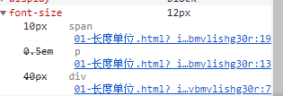

# 长度单位

## px

px是固定像素，一旦设置了就无法做自适应

## em和rem

em和rem相对于px更具有灵活性，他们是相对长度单位，意思是长度不是定死了的，更适用于响应式布局。

对于em和rem的区别一句话概括：**em相对于父元素，rem相对于根元素。**

### em

- 子元素字体大小的em是相对于父元素字体大小
- 元素的width/height/padding/margin用em的话是相对于该元素的font-size

> 也就是说em是一个相对字体大小的长度单位

看一个实例

html

```html
<div>
    我是父元素div
    <p>
        我是子元素p
        <span>我是孙元素span</span>
    </p>
</div>
```

css

```css
div {
  font-size: 40px;
  width: 10em; /* 400px */
  height: 10em;
  border: solid 1px black;
}
p {
  font-size: 0.5em; /* 20px */ 
  width: 10em; /* 200px */
  height: 10em;
  border: solid 1px red;
}
span {
  font-size: 0.5em;  
  width: 10em;
  height: 10em;
  border: solid 1px blue;
  display: block;
}
```

运行效果如图所示


父元素div的宽度为400px

子元素p因为字体大小为0.5em，父元素字体大小为40px，那么元素p的字体大小为40x0.5=20px，p元素的宽度和高度则为10x20=200px

但是孙子元素span的宽度却不是100px，因为chrom设置的最小字号为12px，也就是说及时使用em算出来的结果是10px，最后渲染的时候仍然是12px，就算硬设置为10px也没有，所以最后span元素中字号为12px，宽高为120px



### rem

rem是全部的长度都相对于根元素，根元素是谁？<html>元素。通常做法是给html元素设置一个字体大小，然后其他元素的长度单位就为rem。

```css
html {
  font-size: 10px;
}
div {
  font-size: 4rem; /* 40px */
  width: 30rem;  /* 300px */
  height: 30rem;
  border: solid 1px black;
}
p {
  font-size: 2rem; /* 20px */
  width: 15rem;
  height: 15rem;
  border: solid 1px red;
}
span {
  font-size: 1.5rem;
  width: 10rem;
  height: 10rem;
  border: solid 1px blue;
  display: block;
}
```


由于最小字号为12px

div宽高为360px，但是font-size为40px，也就是说对于font-size属性，强制转换为12px是在计算结束之后如果比12px小才会强制转换，但是在计算长度时，计算之前就已经强制转换为12px，

p元素宽高为180px（12x15），字号为20px

span元素宽高为120px，字号为15px

## vh和vw

vw是可视区宽度单位。1vw等于**可视区宽度**的百分之一。vw单位跟百分比很相似，不同的是vw的值对所有的元素都一样，与他们父元素或父元素的宽度无关。有点像rem单位那样总是相对于根元素。著作权归作者所有。

vh同理，表示的是可视区高度

