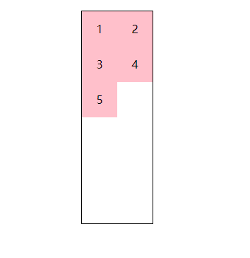
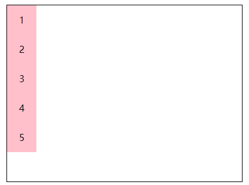

# flex

## float、-webkit-box（老版本flex）、flex效果对比

```html
<style>
  *{
    margin: 0;
    padding: 0;
  }
  #wrap{
    width: 100px;
    height: 300px;
    border: 1px solid;
    margin: 100px auto;
    /*display: flex;*/
    /*display: -webkit-box;*/
  }
  #wrap .item{
    width: 50px;
    height: 50px;
    background: pink;
    text-align: center;
    line-height: 50px;
    float: left;
  }
</style>
</head>
<body>
  <div id = "wrap">
    <div class="item">1</div>
    <div class="item">2</div>
    <div class="item">3</div>
    <div class="item">4</div>
    <div class="item">5</div>
  </div>
</body>
```

- `float`



- `-webkit-box`


- `flex`


## 相关定义

- flex容器/项目
- 主轴/侧轴
- 项目永远在主轴的正方向上排列

## 新老版本属性分析

### 容器

#### 容器的布局方向

- box

```css
#wrap{
  display: -webkit-box;
  /* 控制主轴是哪一根 */
  /* 垂直 */
  -webkit-box-orient: vertical;
  /* 水平 */
  -webkit-box-orient: horizontal;
}
```

- flex

```css
#wrap{
  display: flex;
  /* 行 */
  flex-direction: row;
  /* 列 */
  flex-direction: column;
}
```

水平方向为主轴


垂直方向为主轴



