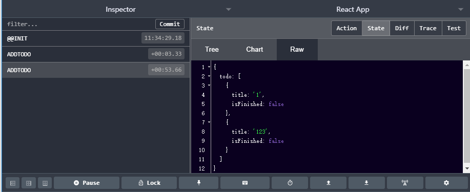
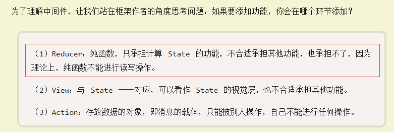

# 采坑合集

## 没有全家桶脚手架

原生的React没有像vue和angular类似的全家桶脚手架，很多东西需要自己去配置，倒是啊里开发的DVA框架是有dva-cli的脚手架

react的cra（create-react-app）封装了webpack，如果需要重新配置webpack，要将相关的配置文件反编译出来

https://blog.csdn.net/xiaominghimi/article/details/90212826

## 文件后缀

主流的React项目中js文件的后缀似乎是.tsx，使用的是typescript的语法，通过官方脚手架`create-react-app`创建的项目中默认使用的是.js文件

### 在官方全家桶中使用typescript

> **为什么要使用typescrip**t
>
> 为了程序的健壮性，typescript的强类型可以防止在开发阶段出现的的各种类型的错误

官方全家桶中默认使用的js，甚至都不是jsx，那么为了使用typescript，首先就得安装typesript

```shell
npm i typescript --save-dev
```

官方全家桶中使用的与React相关的模块也需要安装typescript版本

React

```shell
npm i @types/react --save-dev
```
ReactDOM

```shell
npm i @types/react-dom --save-dev
```

安装完之后代码会提示报错，React模块没有默认导出，但是运行npm start之后就ok了，但是在默认的测试代码中有一个问题


提示安装@types/jest，那咱就装吧

```shell
npm i @types/jest --save-dev
```

### 配置tslint

安装tslint

```shell
npm i tslint --save-dev
```

安装tslint-react

```shell
npm i tslint-react --save-dev
```

配置tsconfig.json

```json
{
  "compilerOptions": {
    "target": "es5",
    "lib": [
      "dom",
      "dom.iterable",
      "esnext"
    ],
    "allowJs": true,
    "skipLibCheck": true,
    "esModuleInterop": true,
    "allowSyntheticDefaultImports": true,
    "strict": true,
    "forceConsistentCasingInFileNames": true,
    "module": "esnext",
    "moduleResolution": "node",
    "resolveJsonModule": true,
    "isolatedModules": true,
    "noEmit": true,
    "jsx": "preserve"
  },
  "include": [
    "src"
  ]
}

```

配置tslint.json

```json
{
  "extends": ["tslint:recommended", "tslint-react"],
  "rules": {
    "arrow-parens": false,
    "arrow-return-shorthand": [false],
    "comment-format": [true, "check-space"],
    "import-blacklist": [true, "rxjs"],
    "interface-over-type-literal": false,
    "interface-name": false,
    "max-line-length": false,
    "member-access": false,
    "member-ordering": [true, { "order": "fields-first" }],
    "newline-before-return": false,
    "no-empty": false,
    "no-any": false,
    "no-empty-interface": false,
    "no-import-side-effect": false,
    "no-namespace": false,
    "no-console": false,
    "no-inferrable-types": [true, "ignore-params", "ignore-properties"],
    "no-invalid-this": [true, "check-function-in-method"],
    "no-null-keyword": false,
    "no-require-imports": false,
    "no-submodule-imports": false,
    "no-this-assignment": [true, { "allow-destructuring": true }],
    "no-trailing-whitespace": true,
    "object-literal-sort-keys": false,
    "object-literal-shorthand": false,
    "one-variable-per-declaration": false,
    "only-arrow-functions": [true, "allow-declarations"],
    "ordered-imports": false,
    "prefer-method-signature": false,
    "prefer-template": [true, "allow-single-concat"],
    "quotemark": [true, "single", "jsx-double"],
    "semicolon": [true, "never", "ignore-interfaces"],
    "trailing-comma": [false],
    "triple-equals": [true, "allow-null-check"],
    "type-literal-delimiter": false,
    "typedef": [true, "property-declaration"],
    "variable-name": [true, "ban-keywords", "check-format", "allow-pascal-case", "allow-leading-underscore"],
    "max-classes-per-file": false,

    "jsx-no-lambda": false,
    "jsx-no-multiline-js": false,
    "jsx-curly-spacing": [true, { "when": "never", "allowMultiline": false }],
    "jsx-boolean-value": false
  }
}

```

可以在这个文件中修改相关规则，顺手就行

## 样式表的使用

据说在组件中通过import引入的样式没有模块作用域，是全局的，没有vue中类似scope的属性，这也就导致了样式表的模块化似乎也是需要自己去配置的，否则会导致不同组件的样式冲突。

### 配置其他类型的css处理文件

- scss

安装node-sass

```shell
npm i node-sass -D
```

### 行内样式的使用

React基本上抛弃了dom相关的操作，完全使用js，所以连css的行内样式都是一个对象

```jsx
var divStyle = {
  color: 'white',
  backgroundImage: 'url(' + imgUrl + ')',
  WebkitTransition: 'all', // 注意这里的首字母'W'是大写
  msTransition: 'all' // 'ms'是唯一一个首字母需要小写的浏览器前缀
};

export default Mycomponent(){
  render(){
    return (
      <div style={divStyle}></div>
    )
  }
}

// 以上是使用对象变量方式的引入，如果想简单引用
export default Mycomponent(){
  render(){
    return (
      <div style={{ marginTop: 10}}></div>
    )
  }
}
```

- 命名：小驼峰，基本告别`margin-top`这种形式
- 单位：如果是长度单位，默认不写表示`px`，**如果硬写`px`，反而会报错**，其他单位照常

### 样式没有模块作用域


## 配置react-router

[官方文档](https://reacttraining.com/react-router/web/guides/quick-start)

由于现在使用ts来开发，所以，recat-router的相关包也需要使用ts版本的

安装依赖

```shell
npm i @types/react-router-dom -D
```

只安装这个依赖，语法没有错误但是会编译报错，提示没有找到`react-router-dom`这个包，需要再次引入

非ts版的`react-router-dom`

```shell
npm i react-router-dom -D
```

## 没有双绑

没有双绑就会导致需要经常去对原生控件的一些事件进行重写，比如input标签的onChange事件，在这个事件中对绑定的state中的属性进行更新

## 绑定事件

React中绑定事件和vue和angular都大不一样来个例子就明白了

```jsx
export class MyInput extends React.Component {
  constructor(props){
    super(props)
    this.state = {
      count: 0
    }
  }
  
  render(){
    return <input onKeyDonwn={this.handleKeyDown}/>
  }
  
  handleKeyDown(e){
    console.log(this.state.count)
  }
}
```

初看起来，好像没什么问题，但是实际上在`handleKeyDown`事件中是获取不到state中的count的，因为在这个函数中的this指向的是input表示的dom对象，有两种解决方法

第一种，使用bind绑定组件this

```jsx
render(){
    return <input onKeyDonwn={this.handleKeyDown.bind(this)}/>
  }
```

第二种，使用箭头函数定义的函数变量

```jsx
handleKeyDown = (e) => {
  console.log(this.state.count)
}
```

个人感觉第二种方法比较得劲

## 事件参数问题

在进行事件注册时经常会在事件处理函数中使用 `event` 事件对象，例如当使用鼠标事件时我们通过 `clientX`、`clientY` 去获取指针的坐标。

大家可以想到直接把 `event` 设置为 `any` 类型，但是这样就失去了我们对代码进行静态检查的意义。

下面来看个demo

```jsx
export class MyInput extends React.Component {
  render(){
    return <input onKeyDonwn={this.handleKeyDown.bind(this)}/>
  }
  
  handleKeyDown(e: KeyboardEvent<HTMLInputElement>){
    console.log(e.keycode)
  }
}
```

这么一写乍一看好像没什么问题，但是这里坑就坑在`keyboardEvent`同时被react和typescript声明了，而由于某些不知名的原因，这里应该默认是使用ts中定义的`keyboardEvent`，所以就会报keyboradEvent不是一个通用类型，意思应该就是这不是一个泛型接口。

我为什么会发现这点呢，这就要归功于强大的IDE——webstorm，它的查找声明定义的功能真的是太顶了


其实这个时候我也只是猜测，是不是因为重复定义的原因导致编译的时候用错了类型，然后修改成了`React.KeyboardEvent<HTMLInputElement>`，果然就成了。

下面是一些常用的事件接口类型

- ClipboardEvent<T = Element> 剪贴板事件接口类型

- DragEvent<T = Element> 拖拽事件接口类型

- ChangeEvent<T = Element> Change 事件接口类型

- KeyboardEvent<T = Element> 键盘事件接口类型

- MouseEvent<T = Element> 鼠标事件接口类型

- TouchEvent<T = Element> 触摸事件接口类型

- WheelEvent<T = Element> 滚轮事件接口类型

- AnimationEvent<T = Element> 动画事件接口类型

## 使用ant-design

依照[官方教程——在TypseScript使用](https://ant.design/docs/react/use-in-typescript-cn)中的步骤来进行配置即可，唯一可能涉及到坑的地方就是css按需配置，按照教程的操作来进行配置，比较简单。

## redux

### redux谷歌开发插件


可以通过谷歌的开发者工具，动态监测redux中状态变化，是一个非常实用的谷歌小插件，但是如果想要在ts中使用，也有点小坑需要踩

根据[官网的使用说明](<https://github.com/zalmoxisus/redux-devtools-extension>)，如果在不添加其他依赖包的情况下，使用这个工具只需要在创建store时的`createStore`函数中使用第二个参数

```
const store = createStore(
	reducer,
	window.__REDUX_DEVTOOLS_EXTENSION__ && window.__REDUX_DEVTOOLS_EXTENSION__()
);
```

`createStore`的第二个参数就是需要添加的内容，但是在ts中会报这样一个错误


可以依据文档中的后面给出的高级设置进行配置。

搞定之后就是下面这个样子，给力嗷



### combineReducers

如果使用了组合reducer，每个ruducer中都有各自的state，那么最后store中的state是怎样的？

```js
const rootReducer = combineReducers({
  todo: todoReducer,
  msg: msgReducer
})
```

在使用这个方法的时候，本质上是对state做了再次封装，以上面的代码为例，想要访问todo模块中state中的数据，那么可以这么使用`this.store.todo.xxx`

### redux中间件redux-thunk

#### 概念

用来处理redux的复杂逻辑，比如异步请求。redux-thunk中间件可以让action创建函数不仅仅返回一个action对象，也可以是返回一个函数

> **个人疑问**
>
> 为什么不把异步操作放在reducer里面执行?去查了阮一峰的教程，发现了原因



#### 使用

- 安装依赖

```shell
npm i redux-thunk -S
```

这里不需要安装ts版本的`redux-thunk`

- 引包

注意这里有一个坑，就是如果想使用中间件的化，需要利用上一节中安装的[redux-devtools-extension](https://github.com/zalmoxisus/redux-devtools-extension)

使用方法，大意就是说和开发工具的中间件一起合并使用

```js
import {combineReducers, createStore, applyMiddleware} from 'redux'
import {todoReducer} from './todo/reducer'
import thunk from 'redux-thunk'

// 安装redux-devtools-extension的可视化工具。
import { composeWithDevTools } from 'redux-devtools-extension/developmentOnly'

const rootReducer = combineReducers({
  todo: todoReducer
})

const store = createStore(rootReducer, composeWithDevTools(
  applyMiddleware(thunk)
))

export default store
```

### redux中间件react-redux

> 注意：redux和react没有任何关系，核心概念就是那一套东西，store、state、action、reduce，这里的react-redux解决了了一些在react中使用redux的痛点问题，在react中使用redux，只要需要使用redux的组件，全部引入了sotre，这就会显得很蠢。而react-redux可以直接把store集成到react应用的顶层prpos里面，方便各个子组件能访问到顶层props。这是其一，第二，它能解决手动监听state中数据改变

- provider

将顶层组件包裹在Provider组件之中，所有组件都处于react-redux的控制之下，store作为参数放到provider组件中，方便其中所有子组件调用

- connect

connec的使用可以让组件中不需要在subscribe数据获取视图的更新，同时提供了两个回调函数`mapStateToProps`和`mapDispatchToProps`，分别将state和dipatch挂载在组件的props属性中