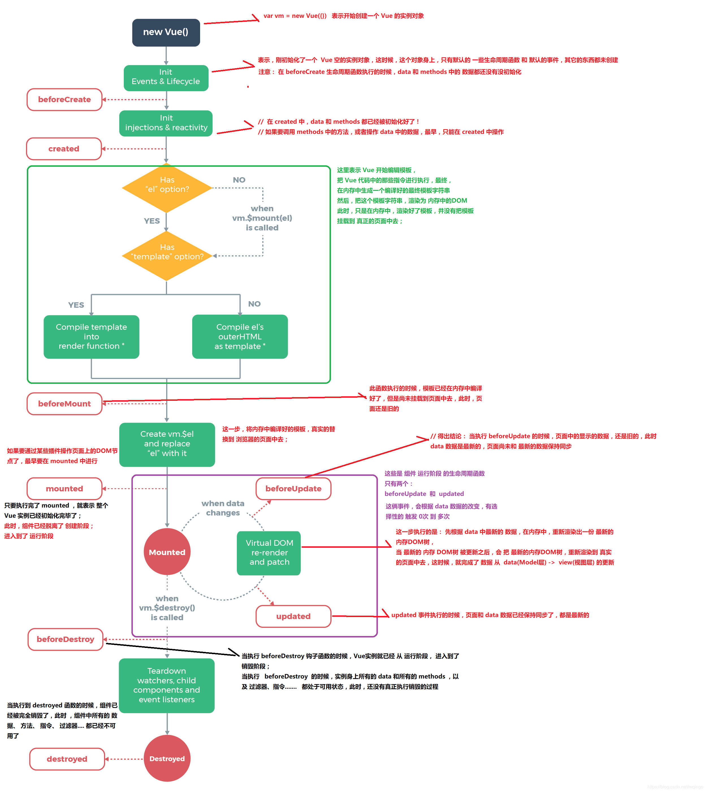

# Vue生命周期

在我的理解里面，每个钩子函数执行的时间是一个时间点，就是在函数执行的那个时刻，真正需要琢磨的是从**一个钩子函数执行完之后到下一个钩子函数触发之前**Vue.j所做的事情



## beforCreate

在这个时刻，vue实例中的el、data、watch、methods、computed属性均未初始化，可以理解为实例创建之前各属性均未初始化。

在这个时刻之前，如图中所示

```js
const vm = new Vue({})
/* 大概就是这么个意思，创建了一个对象，但是相关属性并没有真正赋值
vm = {
  el:undefined,
  data:undefined,
  methods:undefined,
  watch:undefined,
  ...
}*/
```

## created

在这个时刻，实例中除了el属性，其他属性均已初始化，methods中的function直接挂载到实例中，例如

```js
var vm = new Vue({
  el: `#app`,
  data: function(){
    return {
      message: 'hello vue'
    }
  },
  methods: {
    myFirst: ()=>{
      console.log(this.message)
    }
  }
})
```

那么在实例中不是通过`this.methods.myFirst`来访问，而是`this.myFirst`

> 以前未深思，觉得这是个废话，但其实仔细想想就觉得有问题了，也是看了demo中访问el和data使用的是this.$el，this.$data，才会往这方面去想，就连计算属性在实例中究竟是一个function还是一个普通属性也未深思，结果调试之后才发现，计算属性最后在实例上居然和data中的数据一样，直接以属性名挂载在实例上，并且不是一个function，而是fuction的返回值

watch和comoputed属性也已经初始化

也就说，**操作数据，最早在created可以开始执行**

- beforeCerate->created

在这个阶段，vue所做的事情就是初始化除了el之外的其他属性

## beforeMount

此时已经完成了模板的编译和内存中的渲染，但是还没有挂载到页面中，如下图所示，能有一个最直观地反映，模板还是模板，在这个时刻以及这个时刻之前，模板挂载到真正的的页面上


- beforeMount->beforeMount

在这个阶段，vue首先判断实例中有没有el选项，如果没有则停止编译，也就是说从这个时候开始就意味着停止了生命周期，直到在实例上调用vm.$mount(el)，vue开始编译模板，执行vue代码中的那些指令，最终在内存中生成一个编译好的最终模板字符串，然后把这个模板字符串渲染为内存中的dom。

## mounted

此时，已经将编译好的模板，挂载到了页面指定的容器中显示，也就是说如果要**操作实际页面的dom节点，最早就是在这个时刻**

而此时，vue实例的**创建阶段**也已经全部完成

- beforeMounte->mounted

此阶段，将编译好的模板替换到浏览器的页面中去


以上是beforeMoute时刻的el内容


以上是mounted时刻的el内容

## beforeUpdate

在数据更新之前，会触发

## updated

页面重新更新之后触发

- beforeUpdated->updated

此阶段，由于数据发生变化，vue重新编译模板，并将重新编译后的模板替换到浏览器当前显示的页面上。

## beforeDestroy

销毁实例之前触发，所有属性依然能够访问

## destroyed

