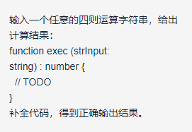

一面面试官给我争取了机会

二面面试官：张舰

# 字节跳动面经

## 一面

1、上来聊vue组件通信、vex、路由实现

2、写一个组件


我的实现

```html
<template>
<div>
   <div v-if:'isLogin'>
       <div>用户姓名：{{user.name}}</div>
       <div>用户id:{{user.userid}}</div>
       
   </div>
   <div v-else>
      <div>未检测到登录用户，请登录</div>
      <router-view />
   </div>
</div>
</template>
   props {
       isLogin:false,
       user{
          name:'',
          userid: '',
          usericon:''
       }
   }
```

3、http报文组成

答了个if-modefie，引申出了e-tag，浏览器缓存机制

问：E-tag保存在哪里，怎么匹配，谁匹配

4、登录流程是怎么样的

具体的session和cookie在整个登录流程中怎么保存的

5、实现每隔一秒输出数组中的一个数字：

```js
function(arr){
  for（let i = 0;i<arr.length;i++）{
    setTimeout(() = > {
      if(i<arr.length){
         console.log(arr[i])
      }
    },1000)
  }
}
```

这种做法是不行的，只能保证在1s之后同时打印出数组中的所有元素

正解

```js
function print2(arr){
	var i = 0;       //在外面定义一个变量作为判断的标准
	var timer = setInterval(function(){
		console.log(arr[i]);
		i++;
		if(i > arr.length-1){       
			clearInterval(timer);
		}
	},1000);
}
```


6、判断单链表是否有环

```js
function main(node){
  let tmp = node.next;
  let nodes = [];
  nodes.push(tmp)
  while(tmp){
    if(isInnodes(node,tmp))
      return true;
    else{
      nodes.push(tmp);
      tmp = tmp.next;
    }
      
  }
  return false;
}
function isInnodes(node,tmp){
  for(let i = 0;i<node.length;i++){
    if(tmp.next===node[i])
      return true;
  }
  return false;
}

```

实现思路：用一个数组保存遍历过的节点，然后依次做匹配，面试官问我时间复杂度，我说n方，面试官觉得有点慢，能不能优化，我想了半天没想出来，就没耽误多久放弃了。

算法还是太差

## 二面

- 第一题：对无序数组 Array(n)，查找第 k 大元素

真的简单，我是个废物，长时间没看排序

- 第二题：



应该是构建一个什么树

我这两题根本没法提笔，这里面试官跟我说可以不考察算法，考察前端相关的内容，因为第一个面试官推荐的时候认为我接触前端不久，所以第二个面试官上来就打算考察我的计算机基础（算法、网络、操作系统），我就想你还是问我前端的吧，然后问我es5、es6熟悉吗，我说还可以（至少比算法强）

- 第三题

```js
document.body.addEventListener('click', () => {
  Promise.resolve().then(()=>console.log(1));
  console.log(2)
});
document.body.addEventListener('click', () => {
  Promise.resolve().then(()=>console.log(3));
  console.log(4)
});
//用鼠标点击一下屏幕，输出结果是什么；为什么？事件循环是什么，微任务是什么，他们的执行顺序是什么样？哪些你知道的方法是微任务？
```

原生dom绑定多个事件怎么玩

我开始答案  2 4 1 3

后来经过面试官的提醒才知道是一个对象绑定了多个事件，我以为会覆盖，改了答案 4 3

正确答案2 1 4 3

这个地方我以为问了宏任务，其实我已经记不清promise和计时器哪个是微任务和宏任务了，就说了个`微任务和宏任务的话有promise和计时器`，然后面试官一听计时器，第四题就来了

- 第四题

```js
console.log('start');
let intervalId;
Promise.resolve()
  .then(() => {
  console.log('p1');
}).then(() => {
  console.log('p2');
});

setTimeout(() => {
  Promise.resolve()
    .then(() => {
    console.log('p3');
  }).then(() => {
    console.log('p4');
  });
  intervalId = setInterval(() => {
    console.log('interval');
  },3000);
  console.log('timeout1');
},0);
// 
// start p1 p2 p3 p4 timeout1 interval
```

曾经我以为我彻底弄懂了事件循环，微任务和宏任务，但是这个地方依然犯了个错误

正确结果：` start p1 p2 timeout1 p3 p4 interval`

- 第五题

```js
function Foo () {
  getName = function () {
    console.log(1)
  }
  console.log('this is' + this)
  return this
}

Foo.getName = function () {
  console.log(2)
}
Foo.prototype.getName = function () {
  console.log(3)
}
var getName = function () {
  console.log(4)
}
function getName () {
  console.log(5)
}
// 请写出一下的输出结果
Foo.getName()  //2
getName() // 4
Foo().getName() //this is window 1
getName()  // 1
new Foo.getName() //2
new Foo().getName() // this is windos 1 纠正 this is object 3
new new Foo().getName() //  this is object 3
```

上面标记了一些答案，有待验证，这题考察的知识点之多，令人发指

- 第六题

```js
window.name = 'ByteDance';
function A () {
  this.name = 123;
}
A.prototype.getA = function(){
  console.log(this);
  return this.name + 1;
}
let a = new A();
let funcA = a.getA;
funcA();
// window
```

这里的调用`funcA()`this应该是指向window，但是我给自己挖了坑，我说我不知道字符串和数字做+运算返回什么

- 第七题

```js
//使用JS实现一个repeat方法，
function repeat (func, times, wait) {
  // Todo
};
const repeatFunc = repeat(alert, 4, 3000);
//调用这个 repeatedFunc("hellworld")，会alert4次 helloworld, 每次间隔3秒
```

我的实现

面试官说我一面的时候做法好像有些问题，所以又给我出了一道类似的题

第一次

```js
function(func ,times, wait){
  return function(str){
    for(let i=0;i<times;i++)
      setTimeout(()=>{
        func(str)
      },wait)
  }
}
```

面试官说这种做法要创建多个计时器，性能太差，然后我换了setInterval

```js
function(func ,times, wait){
  return function(str){{
      setInterval(() => {
        while(times--){
        func(str) 
        }
      },wait)
     }
  }
}
```

真实效果应该是和我想的不一样，面试官也指出不对

正解

```js
function fun2(func, times, wait) {
	return function (str) {
		let i = 0;
		const timer = setInterval(() => {
			i++
			func(str)
			if(i === times)
				clearInterval(timer)
		}, wait)

	}
}
```

> 以后这种类似的需求得用setInerval来做，并且不要使用while或者for之类的循环

- 第八题

一个轻量页面中存在一个用户生日输入框，用input type=text来实现, 实现对任意输入的字符串的 validate 和 parse，输出为 Date 对象。

eg: yyyy-mm-dd

当时我就答到：这个就是正则加字符串转date，但是我从来不记api，我写不出来

正解：

```js
let reg = /^[1-9]\d{3}-([0[1-9]|1[0-2])-(0[1-9]|[1-2]\d|3[0-1])\s+([0-1]\d|2[0-3]):[0-5]\d:[0-5]\d&/
// 这只是初步判断，每月的31号是否有无，以及润年的2月判断
```


然后面试官非常语重心长的给了我很多建议

> 面试面试，就和高考一样，这是要走流程的，不是说你会就行，谁知道你会，你得写在系统里面，面试的人那么多，人家会写你不会，肯定就不会选你了，面试的流程都是要review的，得看你有多少输出（面试系统的代码量），不是说这个面试官选你就选你了，这个面试官选你之后，下一个面试官一检验发现没有那么合格，上一个面试官是要背责任的（然后我感觉很愧对第一个面试官，第二个面试官说，二面机会是第一个面试官给我争取来的）

[面试官推荐复习资料](https://yuchengkai.cn/docs/frontend/)

leetcode

## 总结

非常感谢我的两个面试官，第一个给了我推荐，第二个给了我很多建议，并且全程鼓励指引，非常和蔼。下面的复习目标，巩固现有知识内容，加强算法和基础coding能力